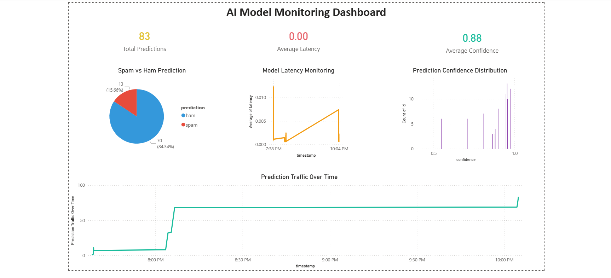
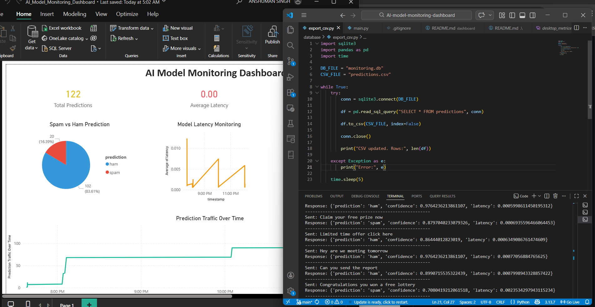

# AI Model Monitoring Dashboard

A real-time monitoring system for machine learning predictions built using **FastAPI, Python, and Power BI**.
The project simulates production traffic, logs prediction metrics, and visualizes model performance through an analytics dashboard.

---

## Project Overview

This project demonstrates how machine learning models can be monitored in production environments.
The system collects prediction data, tracks performance metrics, and visualizes insights through an interactive dashboard.

The monitoring pipeline tracks:

* Prediction volume
* Spam vs Ham classification distribution
* Model confidence scores
* API latency performance

---

## System Architecture

The system simulates a production machine learning monitoring pipeline. Incoming requests are processed by a FastAPI service, predictions are generated using a trained spam detection model, and performance metrics are logged and visualized through a Power BI dashboard.

### Architecture Flow

```
Traffic Simulator
        ↓
FastAPI Prediction API
        ↓
Spam Detection Model (TF-IDF + Logistic Regression)
        ↓
SQLite Monitoring Database
        ↓
CSV Export Pipeline
        ↓
Power BI Monitoring Dashboard
```


## Tech Stack

**Backend**

* Python
* FastAPI
* Scikit-learn
* SQLite

**Data Processing**

* Pandas
* CSV data pipeline

**Visualization**

* Power BI

---

## Features

* Real-time API prediction monitoring
* Traffic simulator generating continuous requests
* Logging of prediction metrics and latency
* Dashboard visualization of model performance
* Monitoring pipeline similar to production ML systems

---

## Dashboard Preview

### AI Model Monitoring Dashboard



### Prediction Metrics Visualization



---

## How to Run the Project

### 1 Install Dependencies

```
pip install -r requirements.txt
```

---

### 2 Initialize Database

```
python database/init_db.py
```

---

### 3 Start the API

```
uvicorn api.main:app --reload
```

---

### 4 Run Traffic Simulator

```
python simulator/traffic_generator.py
```

---

### 5 Export Monitoring Data

```
python database/export_csv.py
```

---

### 6 Open Dashboard

Open the Power BI file:

```
dashboard/AI_Model_Monitoring_Dashboard.pbix
```

Refresh the data to see live monitoring metrics.

---

## Project Structure

```
AI-model-monitoring-dashboard
│
├── api
├── model
├── simulator
├── database
├── dashboard
├── requirements.txt
└── README.md
```

---

## Key Learning Outcomes

* Deploying machine learning models with FastAPI
* Building monitoring pipelines for ML systems
* Logging prediction metrics and performance
* Creating analytics dashboards with Power BI
* Simulating production traffic for testing
